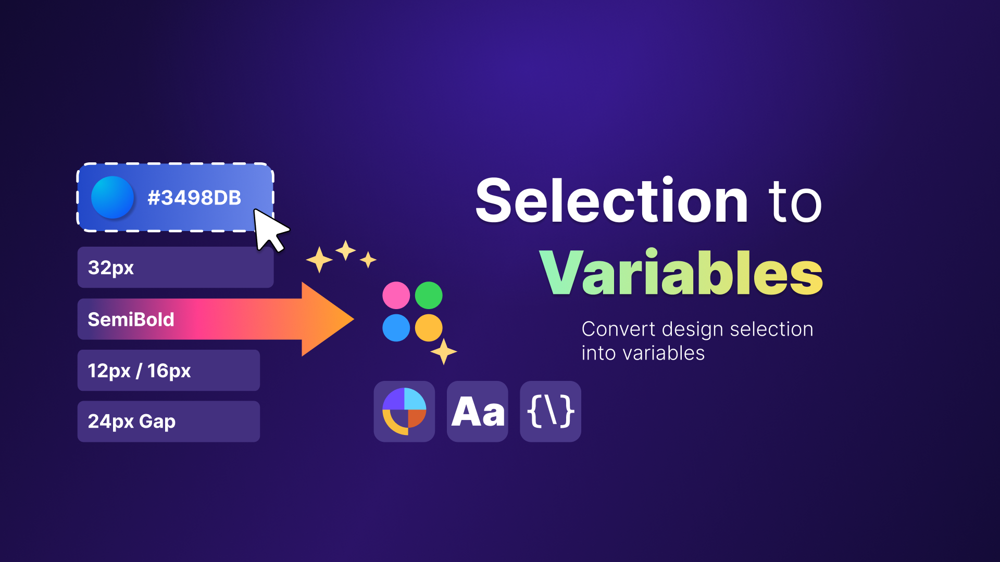

# Selection to Variables



Selection to Variables is a Figma plugin for turning raw selection data into reusable design assets.

It scans selected layers, detects token candidates, exports JSON, creates variables, and generates reusable text, color, and effect styles.

Current package version: `1.0.0`

## Overview

The plugin is designed to help transform unstructured design values into a more systematic setup inside Figma.

It can:

- scan `Groups`, `Frames`, and `Sections`
- detect token candidates from colors, text values, sizes, and spacing
- identify repeated values automatically
- suggest semantic naming
- create or reuse variables
- create or reuse text, color, and effect styles
- apply variables and styles back to the current selection
- export reviewed tokens as JSON

## Features

- Variable creation and reuse
- Text style creation and reuse
- Color style creation and reuse
- Effect style creation and reuse
- Variable-aware style generation when compatible variables already exist
- JSON export for reviewed tokens
- Automatic repeated-token detection
- Semantic grouping for scanned values
- Optional auto-refresh when the selection changes
- Support for choosing an existing variable collection and mode or creating a new one

## How It Works

1. Select one or more `Groups`, `Frames`, or `Sections`
2. Click `Read selection`
3. Review:
   - `Selection tokens`
   - `Text styles`
   - `Color styles`
   - `Effect styles`
4. Choose which outputs you want to generate
5. Use `Create`, `Create and apply`, or `Export JSON`

## Variable-Driven Styles

When compatible variables already exist, the plugin can use them while generating styles.

Supported bindings include:

- `Text styles`
  - `fontSize`
  - `lineHeight`
  - `letterSpacing`
  - `paragraphSpacing`
  - `fontFamily`
  - `fontStyle`
- `Color styles`
  - paint color
- `Effect styles`
  - color
  - radius
  - spread
  - offset X
  - offset Y

If no compatible variable is found, the plugin still creates the style using raw values.

## Install

```powershell
npm install
npm run build
```

Then in Figma Desktop:

1. Open `Plugins > Development > Import plugin from manifest...`
2. Select `manifest.json`
3. Open `Selection to Variables` from the Development plugins list

## Development

Build once:

```powershell
npm run build
```

Watch mode:

```powershell
npm run watch
```

Run tests and type-checking:

```powershell
npm test
npx tsc --noEmit
```

## Project Structure

- `src/code.ts` - plugin logic
- `src/ui.html` - UI template
- `src/ui.ts` - UI behavior
- `tests/` - test files
- `assets/img/` - plugin assets
- `manifest.json` - Figma plugin manifest

## Notes

- The plugin reuses existing collections, modes, variables, and styles when names match
- JSON export is generated from token names and builds a nested token tree
- The UI supports reviewing and renaming tokens and styles before creation
- License: `MIT`

## Release Checklist

Before publishing or sharing a release:

- Run `npm test`
- Run `npx tsc --noEmit`
- Run `npm run build`
- Confirm `manifest.json` points to the correct build files
- Reload the plugin in Figma and validate:
  - `Read selection`
  - `Export JSON`
  - `Create`
  - `Create and apply`
- Verify variables, text styles, color styles, and effect styles are being created correctly
- Review the README and package metadata before publishing

## Status

The project is in a strong working state and ready for continued refinement or public packaging.
